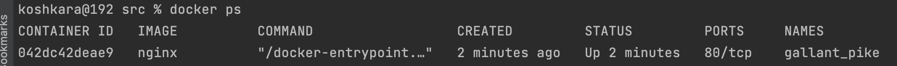
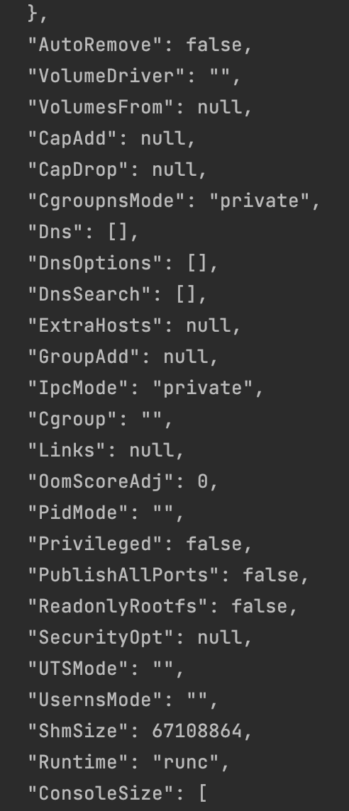
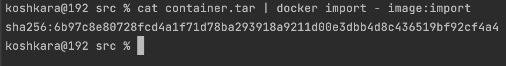

## Part 1. Ready-made Docker

1. Downloading the official docker image from nginx using `docker pull`

    

2. Check for the docker image with `docker images`

   

3. Run docker image

   

4. Check that the image is running

   

5. View container information

   

    

   

   

   

   

   

   

   

6. From the command output

   1) the container size
   
      

   2) list of mapped ports

      

   3) container ip 

      

7. Stop docker image

   

8. Check that the image has stopped

   

9. Run docker with mapped ports 80 and 443 on the local machine

   

10. Check that the nginx start page is available in the browser at `localhost:80`

   

11. Check that the container is running

   

## Part 2. Operations with container

1. Read the nginx.conf configuration file inside the docker container

   

   

2. Create a nginx.conf file on a local machine

   

3. Configure nginx.cong file on the /status path to return the nginx server status page

   

4. Copy the created nginx.cong file inside the docker image

   

5. Restart nginx inside the docker image

   

6. Check that localhost:80/status

   

7. Export the container to a `container.tar`

   

8. Stop the container

   

9. Delete the image without removing the container first

   

10. Delete stopped container

   

11. Import the container back

   

12. Import the container back

   

13. Run the imported container

   

14. Check the localhost:80/status

   

## Part 3. Mini web server

1. Mini server in C and FastCgi

   

2. Downloading the official docker image from nginx

   `docker pull nginx` 

3. Running docker image

   `docker run -d -p 81:81 nginx`

4. Check that the image is running

   `docker ps`

5. Copy the created nginx.conf file inside the docker image

   `docker cp ./nginx.conf NAME:/etc/nginx/`

6. Copy the created mini server in C inside the docker image

   `docker cp ./hello.c NAME:/home/`

7. Execute an interactive bash shell on the container

   `docker exec -it NAME bash`

8. Installing updates

   `apt update`

9. Installing the spawn-fcgi utility which allows to spawn remote and local FastCGI processes

   `apt install spawn-fcgi`

10. Installing FastCGI packages

   `apt install libfcgi-dev`

11. Installing the gcc compiler

   `apt install gcc`

12. Move to the home directory

   `cd ./home/`

13. Compile the program

   `gcc hello.c -o hello -lfcgi`

14. Spawn FastCGI process

   `spawn-fcgi -p 8080 ./hello`

15. Reload nginx

   `nginx -s reload`

16. Check the page with the web server

   `curl localhost:81`

## Part4. Your own docker

1. Create the Dockerfile

   `touch Dockerfile`

2. Build an image from the Dockerfile

   `docker build -t test:new .`

3. Check the image was created correctly

   `docker images`

4. Run the image

   `docker run -d -p 80:81 -v "$(pwd)"/nginx/:/etc/nginx/ test:new`

5. Check the page with the mini server

   `curl localhost:80`

6. Restart docker container, after editing nginx.conf

   `docker container restart <NAME>`

7. Check that the page with nginx status

   `curl localhost:80/status`

## Part 5. Dockle

1. Install dockle

   `brew install goodwithtech/r/dockle`

2. Check the image from the previous task

   `dockle --accept-key NGINX_GPGKEY test:new`

3. Fix the image

## Part 6. Basic Docker Compose

1. Write and build docker-compose.yml file

   `docker compose build`

2. Run the project

   `docker compose up -d`

3. Check that everything fine

   `curl localhost:80`